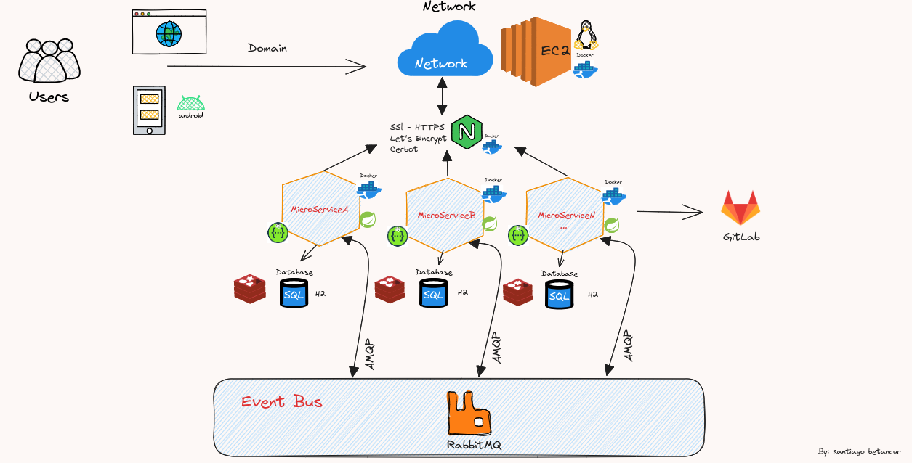

# servicio-cuenta-movimiento-banco
Micro servicio de cuentas y movimiento asincrónica

# Definicion de la Arquitectura principal para comunicación de Microservicios por Eventos para una entidad Bancaria

# Imagen de una cuentas y movimientos asincrónica, este conecta con rabbitMQ manejando colas, para funcionar con clientes.

## Tener descargado rabbitMQ con: 

### latest RabbitMQ 3.12
docker run -it --rm --name rabbitmq -p 5672:5672 -p 15672:15672 rabbitmq:3.12-management

## Realizar el pull de este micro en la versión 0.0.2-SNAPSHOT:

## Después ejecutar con la ip de el rabbitmq y cliente:

docker run -d --network bridge --name serviciocuenta -p 8090:8090 -e IP_RABBIT=172.17.0.2 -e IP_CLIENTE=http://172.17.0.3:8089/api santbetv/microservice-docker-serviciocuentamovimiento:0.0.2-SNAPSHOT